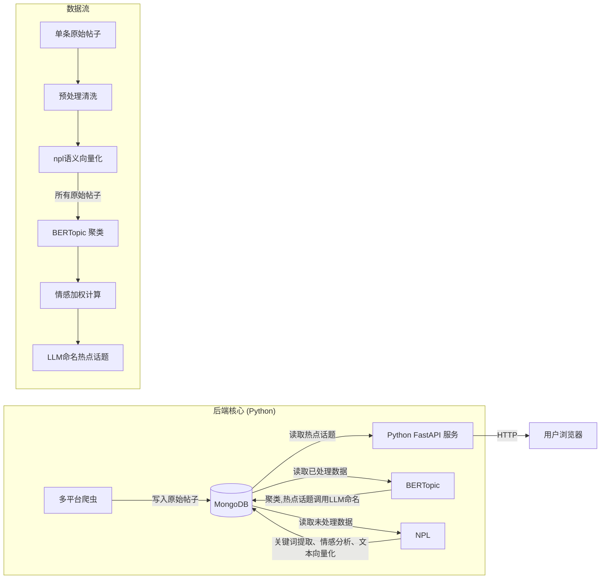

# 社交网络话题挖掘及可视化系统 (Social-Topic-Insight)

## 1. 问题描述
问题描述： 社交媒体平台每天产生数以亿计的用户生成内容，其中蕴含着丰富的话题信息、舆论 趋势和社会热点。例如，微博每天有超过 1亿条微博发布，抖音每天有数千万个视频 上传，这些内容反映了公众对各种事件、产品、政策的真实态度和关注焦点。传统的 话题挖掘方法往往基于长文本设计，无法有效处理社交媒体文本的特殊性：文本长度 短（如微博限制 140字）、语言表达非正式（如网络用语、缩写）、包含大量表情符 号和图片、存在大量噪声信息（如广告、垃圾信息）等。此外，社交媒体话题具有爆 发性强、传播速度快、生命周期短的特点，传统方法难以实时捕捉突发热点和话题演 化趋势。现有技术还面临着如何处理多模态内容（文本+图片+视频）、如何识别虚假 信息和水军账号、如何区分真实热点和人为炒作等挑战。本题目要求开发一个智能的 社交网络话题挖掘系统，能够从海量、嘈杂的社交媒体数据中准确识别真实热点话 题、实时追踪话题演化轨迹，并通过直观的可视化方式展示话题的传播路径、影响范 围和发展趋势。 

实现要求： 多平台数据采集：实现微博、Twitter、抖音等平台的数据爬取和 API接口调用 

​	文本预处理优化：处理表情符号、网络用语、@用户、#话题#等社交媒体特有元素 

​	话题建模算法：实现 LDA、BTM、BERT-Topic等话题模型，适应短文本特征 

​	热点话题检测：设计基于时间序列的话题热度计算和突发话题检测算法

​	话题演化追踪：分析话题的生命周期、传播路径和演化趋势 

​	多维度可视化：实现词云、话题网络图、时间线、地理分布等多种可视化方式 

​	实时监控系统：构建话题监控仪表板，支持实时数据更新和告警 

​	情感倾向分析：分析不同话题的情感极性和公众态度 

开源参考： • https://github.com/ddangelov/Top2Vec 

​			• https://github.com/MaartenGr/BERTopic

本项目开发了一个智能的社交网络话题挖掘系统，能够：
1.  **多源采集**：从微博等平台获取海量真实语料。
2.  **深度挖掘**：利用 **BERTopic** 和 **Transformer** 模型识别隐含话题与情感倾向。
3.  **动态演化**：追踪话题随时间的热度流变与突发状态。
4.  **可视化交互**：通过 Vue3 + ECharts 实现全景舆情监控。

## 2. 技术架构

本项目采用 **前后端分离** 的轻量化微服务架构，，直接利用 Python 生态打通 数据采集 -> AI 分析 -> Web 接口的全链路。


### 2.1 技术栈
- **前端 (Visualization):** Vue 3, Element Plus, ECharts (WordCloud, Graph)
- **后端与算法 (Backend & AI):** 
    - **Web 框架:** Python FastAPI (高性能异步框架)
    - **爬虫:** Requests, BeautifulSoup4 (工厂模式设计)
    - **NLP 核心:** BERTopic, Sentence-Transformers, Jieba, UMAP, HDBSCAN
- **数据库 (Storage):** 
    - **MongoDB:** 存储非结构化社交文本及高维向量数据。

### 2.2 系统架构图



## 3. 数据库设计 (MongoDB)

系统核心包含四大集合（Collections），支撑从采集到展示的全流程：

1.  **`crawler_tasks`**: 任务调度表，记录用户下发的爬取任务（关键词、状态、进度）。
2.  **`social_posts`**: 核心数据表。
    -   存储原始抓取数据（内容、点赞、转发、时间）。
    -   存储 AI 中间产物（Embedding 向量、清洗后文本）。
    -   存储分析结果（TopicID、情感分数、关键词）。
3.  **`analyzed_topics`**: 话题元数据表。存储聚类后的“话题实体”，包含话题名称、总热度、是否“爆”等标签。
4.  **`topic_trends`**: 时序统计表。用于前端绘制“河流图”和“趋势折线图”，记录每个话题在每小时的热度变化。

## 4. 核心业务模块详解 (`modules`)

系统的核心业务逻辑完全解耦在 `modules` 目录下，划分为**数据采集**、**智能分析**、**接口服务**三大子模块，各司其职。

### 4.1 数据采集模块 (`modules/crawler`)
负责多平台数据的抓取、解析与入库，采用**工厂模式**设计，便于后续扩展新平台。

*   **`factory.py` (爬虫工厂)**: 实现了简单工厂模式，根据传入的平台名称（如 `weibo`, `douyin`）动态实例化对应的爬虫类，统一了调用接口。
*   **`engine.py` (调度引擎)**: 爬虫任务的指挥官。负责接收任务配置，通过工厂创建爬虫实例，控制抓取频率（防封禁延时），并实时更新 `crawler_tasks` 表的任务状态和进度日志。在抓取完成后，它会自动触发 `analysis.manager` 启动后续的分析流程。
*   **`base.py` (基类)**: 定义了 `BaseCrawler` 抽象基类，封装了数据库连接初始化、索引创建以及通用的 `save_data`（数据去重入库）方法，规范了所有具体爬虫的行为。
*   **`spiders/` (具体实现)**:
    *   `weibo.py`: 针对微博热搜榜和关键词搜索页，解析 HTML 结构抓取博文内容及互动数据。
    *   `douyin.py` / `bilibili.py`: 针对视频平台，解析 API 返回的 JSON 数据或通过自动化工具获取视频标题、播放量等元数据。
*   **`config.py`**: 存储爬虫相关的配置，如 Cookie 池、User-Agent 列表以及智能预测模式下的“种子关键词库”。

### 4.2 智能分析模块 (`modules/analysis`)
系统的“大脑”，负责对采集到的非结构化数据进行清洗、理解、聚类和知识提取。

*   **`manager.py` (分析管理器)**: 也就是 Pipeline 的编排者。它定义了 `run_full_pipeline` 方法，按顺序调度数据清洗、NLP 处理、聚类分析等步骤，实现了从 Raw Data 到 Insight 的全流程自动化。
*   **`nlp_base.py` (NLP 基础设施)**: 单例模式封装。加载了 `Jieba` 分词器（含自定义词典）、`SentenceTransformer` 向量化模型以及情感分析模型。提供了统一的 `get_embedding` 和 `get_sentiment` 接口。
*   **`cleaning.py` (文本清洗)**: 提供静态工具方法，使用正则表达式去除 HTML 标签、URL 链接、冗余的 `@用户` 和特殊符号，保留文本的核心语义。
*   **`clustering.py` (聚类引擎)**: **核心算法所在**。
    *   实现了 **BERTopic** 的完整流程（UMAP 降维 + HDBSCAN 聚类）。
    *   集成了 **热度加权算法**，计算话题的全局热度与演化趋势。
    *   实现了 **LLM (DeepSeek/Google)** 的调用逻辑，为聚类出的 Top 50 话题生成简短的新闻标题。

### 4.3 接口服务模块 (`modules/api`)
基于 FastAPI 构建的 RESTful API 层，负责前后端的数据交互。

*   **`router.py`**: 路由分发中心，将不同功能区的路由（Tasks, Analysis）注册到主应用中。
*   **`endpoints/tasks.py`**: 处理爬虫任务相关的请求。支持创建新任务（触发后台线程）、查询任务列表、删除历史任务。
*   **`endpoints/analysis.py`**: 处理数据可视化相关的请求。包含热点排行榜、仪表盘统计、话题关系图谱（Graph）、词云（WordCloud）以及特定话题的深度详情接口。
*   **`utils.py`**: 封装了统一的 API 响应格式（`resp_200`, `resp_400`），规范了 JSON 返回结构。

---

## 5. 基础设施与前端展示

### 5.1 后端基础设施
除了业务模块外，根目录下的几个核心文件夹提供了系统运行的底层支撑。

*   **核心配置 (`core/`)**:
    *   `config.py`: 加载环境变量（`.env`），管理数据库连接串、API Keys 等敏感信息。
    *   `database.py`: 封装 `PyMongo`，实现了 MongoDB 的单例连接池，提供线程安全的数据库访问对象。
    *   `logger.py`: 配置全局日志系统，支持控制台输出与文件轮转记录（`logs/app.log`），便于生产环境排错。
*   **数据模型 (`models/`)**:
    *   基于 `Pydantic` 定义了与 MongoDB 集合一一对应的 ORM 模型（如 `SocialPost`, `CrawlerTask`, `AnalyzedTopic`）。
    *   确保了数据在 Python 对象与 NoSQL 文档之间转换时的类型安全与结构一致性。

### 5.2 前端可视化系统
前端采用 **Vue 3 + Element Plus** 构建，通过 **ECharts** 实现数据的高级可视化。

*   **总览仪表盘**: 展示全网实时热度趋势（折线图）及各平台数据占比（饼图）。
*   **话题关系图谱**: 复刻了 Intertopic Distance Map，使用气泡图展示话题的语义距离与热度差异，支持缩放与悬停交互。
*   **深度分析页**:
    *   **词云**: 展示话题核心关键词。
    *   **河流图**: 展示话题在时间轴上的演化过程。
    *   **情感分布**: 环形图展示舆论的正负面倾向。

---

## 6. 快速启动

### 6.1 环境与依赖
*   Python 3.11+
*   MongoDB 5.0+
*   Node.js 16+

### 6.2 启动步骤

1. **配置环境**:
   在根目录创建 `.env` 文件，填入 MongoDB 地址 , 微博cookie及 LLM API Key。

2. **启动后端**:
   ```bash
   # 安装依赖
   pip install -r requirements.txt
   # 启动 FastAPI 服务
   python Social_Topic_Insight_3\main.py
   ```

3. **启动前端**:

   双击运行 vue-begin.bat 文件.

4. **访问系统**:
   打开浏览器访问 `http://localhost:5173` 即可进入系统控制台。
