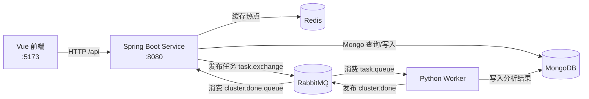

# 社交话题洞察系统（Social Topic Insight）

## 1. 项目简介
本项目用于社交媒体话题采集、聚类分析与可视化展示，当前采用三层协作架构：

- `Vue 3` 前端负责交互与可视化
- `Spring Boot` 负责 API 接口、任务调度、缓存与 LLM 回调处理
- `Python Worker` 负责爬虫与分析流水线执行

## 2. 当前架构


```mermaid
graph LR
  FE[Vue 前端\n:5173] -->|HTTP /api| BE[Spring Boot Service\n:8080]
  BE -->|Mongo 查询/写入| M[(MongoDB)]
  BE -->|缓存热点| R[(Redis)]
  BE -->|发布任务 task.exchange| MQ[(RabbitMQ)]
  MQ -->|消费 task.queue| PY[Python Worker]
  PY -->|写入分析结果| M
  PY -->|发布 cluster.done| MQ
  MQ -->|消费 cluster.done.queue| BE
```

### 2.1 职责划分
- 前端：任务创建、任务列表、热点话题、图表展示
- Spring：
  - `POST /api/tasks` 创建任务并投递 MQ
  - `GET /api/tasks` 查询任务
  - `DELETE /api/tasks/{id}` 删除任务
  - `GET /api/analysis/hot-topics` 获取热点（含 Redis 缓存）
- Python Worker：
  - 消费任务消息
  - 执行抓取 + 清洗 + 聚类
  - 回写 Mongo
  - 发布 `cluster.done` 通知 Spring 继续做 LLM 标题/摘要等后处理

## 3. 代码目录

```text
allCode/
├─ Social_Topic_Insight_spring/
│  ├─ common/                       # DTO/VO/Entity
│  └─ service/                      # Controller/Service/Config
├─ Social_Topic_Insight_python/
│  ├─ modules/crawler/              # 爬虫执行
│  ├─ modules/analysis/             # 清洗、向量化、聚类
│  ├─ worker.py                     # RabbitMQ 消费者（主工作进程）
│  └─ main.py                       # FastAPI（可选，调试/兼容用）
└─ vue/word-cloud-visualization/
   ├─ src/App.vue                   # 主界面
   ├─ src/main.js                   # Vue 入口
   └─ src/utils/request.js          # Axios 封装（默认指向 8080）
```

## 4. 运行依赖
- Node.js `20+`
- Java `17+`
- Maven `3.9+`
- Python `3.11+`
- MongoDB `6+`
- Redis `7+`
- RabbitMQ `3.12+`

## 5. 快速启动

### 5.1 启动基础设施
确保 MongoDB / Redis / RabbitMQ 已启动并可访问本机默认端口。

### 5.2 启动 Spring 服务（API + 调度）
```powershell
cd g:\Desktop\allCode\Social_Topic_Insight_spring
mvn -pl service -am spring-boot:run
```
默认监听 `http://localhost:8080`。

### 5.3 启动 Python Worker（任务执行）
```powershell
cd g:\Desktop\allCode\Social_Topic_Insight_python
pip install -r requirements.txt
python worker.py
```

> 可选：如果你还需要单独调试 Python API，可运行 `python main.py`（默认 8000 端口）。

### 5.4 启动前端
```powershell
cd g:\Desktop\allCode\vue\word-cloud-visualization
npm install
npm run dev
```
访问：`http://localhost:5173`

## 6. 环境变量

### 6.1 Spring（`service/src/main/resources/application.properties`）
支持通过环境变量覆盖：
- `MONGO_URI`
- `REDIS_HOST` `REDIS_PORT`
- `RABBITMQ_HOST` `RABBITMQ_PORT` `RABBITMQ_USERNAME` `RABBITMQ_PASSWORD`
- `DEEPSEEK_BASE_URL` `DEEPSEEK_API_KEY` `DEEPSEEK_MODEL`

### 6.2 Python（`Social_Topic_Insight_python/.env`）
常用项：
- `MONGO_URI` `DB_NAME`
- `RABBITMQ_HOST` `RABBITMQ_PORT` `RABBITMQ_USERNAME` `RABBITMQ_PASSWORD`
- `WEIBO_COOKIE`
- `DEEPSEEK_API_KEY` / `GOOGLE_API_KEY`

## 7. 联调说明
前端默认请求地址在 `src/utils/request.js`：
- `baseURL: http://localhost:8080/api`

如果你改了后端端口，请同步修改该文件。

## 8. 常见问题
- 新建任务失败：先确认 Spring 与 Worker 都在运行，且 RabbitMQ 连接正常。
- 热点列表为空：通常是任务尚未完成分析，或 Mongo 中暂无可展示数据。
- 前端无法请求：确认 `8080` 端口可达，以及浏览器控制台中具体报错信息。
